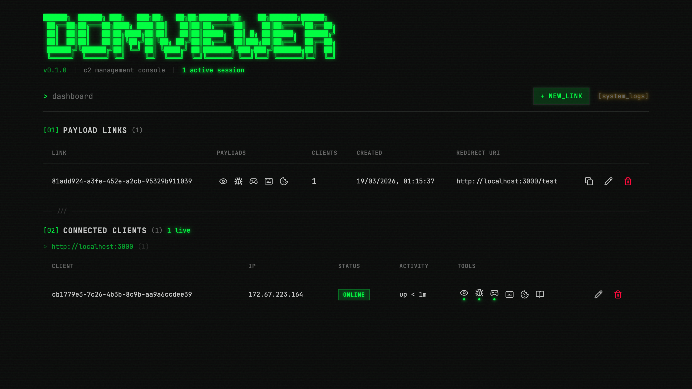

# domviewer

A modular browser-based C2 framework for security research. Inject a single `<script>` tag into a target page to gain real-time DOM mirroring, interactive remote control, link crawling, keystroke capture, and cookie exfiltration — all streamed live to a management dashboard over WebSockets.



> **For authorized security testing only.** This tool is intended for penetration testing engagements, red team exercises, CTF competitions, and security research conducted with proper authorization.

## Features

- **DOM Viewer** — Live read-only mirror of the target page's DOM, updated via binary delta streams
- **Remote Control** — Interactive proxy: click, type, scroll, and navigate the target page from your browser
- **Spider** — Crawl same-origin links and exfiltrate page content as downloadable archives
- **Keylogger** — Capture keystrokes and form input, grouped by element with password masking
- **Cookies** — Poll and diff `document.cookie`, tracking additions, changes, and removals over time
- **Per-client payload control** — Enable/disable any payload per client at runtime with live push
- **Persistent storage** — All captured data (spider results, keystrokes, cookies, logs) survives restarts via SQLite
- **Automatic reconnection** — Client loader reconnects with exponential backoff, re-syncs payload state

## Quick Start

### Docker (recommended)

```bash
docker compose up
```

### From source

```bash
npm install
npm run build:all
npm start
```

The management dashboard will be at `http://localhost:3000` and the C2 server at `http://localhost:3001`.

## Usage

1. Open the dashboard and click **+ new_link** to create a payload link. Select which payloads to enable and optionally set a redirect URI.
2. Copy the generated `<script>` tag and inject it into the target page.
3. The client appears in the dashboard. Click into any tool to view live data.

Payload links are templates — each browser that loads the script becomes an independent client with its own payload config, data, and lifecycle.

## Architecture

Two HTTP servers share a SQLite database and in-memory runtime state:

| Server | Default Port | Role |
|---|---|---|
| **C2** | 3001 | Serves the loader bundle, handles payload WebSocket connections from targets |
| **Management** | 3000 | React SPA dashboard, REST API, viewer WebSocket for live data streaming |

```
Target Browser          C2 Server (:3001)        Management Server (:3000)
+--------------+       +------------------+      +------------------------+
| loader.js    |--WS-->| /ws              |      | React SPA (/)          |
|  +- domviewer|       |   routes messages|      | REST API (/api/*)      |
|  +- proxy    |       |   to payload     |      | Viewer WS (/view)      |
|  +- spider   |       |   handlers       |      | Test site (/test*)     |
|  +- keylogger|       +--------+---------+      +----------+-------------+
|  +- cookies  |                |                            |
+--------------+                v                            v
                         +-------------+            +--------------+
                         |  state.js   |<---------->|management.js |
                         |  (runtime)  |            | (API + WS)   |
                         +------+------+            +--------------+
                                |
                                v
                         +-------------+
                         |  SQLite DB  |
                         +-------------+
```

### Data flow

1. The loader iframes the target page, connects to the C2 WebSocket, and sends an `init` handshake.
2. The C2 server validates the link, registers the client, and pushes `load` messages for each enabled payload.
3. Each payload module runs in the target's context and streams data back via text or binary WebSocket frames.
4. The C2 routes incoming messages to the appropriate server-side payload handler, which updates state and pushes to any connected viewer WebSockets.
5. The React dashboard receives updates in real-time — no polling.

## Payloads

### DOM Viewer

Captures a full DOM snapshot on load, then streams incremental deltas via MutationObserver. Binary frames use a JSON-encoded format with add/remove/children/attrs/text operations. The viewer reconstructs and renders the DOM client-side.

### Remote Control (Proxy)

Creates a hidden offscreen iframe on the target, serialises its DOM, and streams it to the viewer. User interactions in the viewer (clicks, keystrokes, scrolling, form input) are relayed back and dispatched on the target's real DOM. Supports mouse events, keyboard input with synthesised InputEvents, focus tracking, value sync for form fields, and in-page navigation.

### Spider

Crawls same-origin links from the target page. Discovered URLs are reported and persisted in SQLite. Supports on-demand content exfiltration — fetched pages are stored as versioned blobs and downloadable as a zip archive.

### Keylogger

Attaches capture-phase `input`, `keydown`, and `change` listeners on the target document. Entries are batched every 500ms and persisted in SQLite. The dashboard groups entries by form element with collapsible detail, and masks password fields by default.

### Cookies

Polls `document.cookie` every 2 seconds and on each navigation. Only JavaScript-accessible cookies are captured (`HttpOnly` cookies are excluded by the browser). Changes are diffed and persisted. The dashboard shows both a deduplicated "current" view and a full chronological history.

## API

### C2 server

| Route | Description |
|---|---|
| `GET /payload.js/:linkId` | Loader bundle with injected link ID and C2 WebSocket URL |
| `WS /ws` | Payload WebSocket |

### Management server

**Links**
| Method | Route | Description |
|---|---|---|
| `POST` | `/api/links` | Create payload link |
| `GET` | `/api/links` | List all links |
| `GET` | `/api/links/:id` | Get link details |
| `PATCH` | `/api/links/:id` | Update link template (new clients only) |
| `DELETE` | `/api/links/:id` | Delete link |

**Clients**
| Method | Route | Description |
|---|---|---|
| `GET` | `/api/clients` | List all clients |
| `GET` | `/api/clients/:id` | Get single client |
| `PATCH` | `/api/clients/:id` | Update payloads + config (live push) |
| `DELETE` | `/api/clients/:id` | Destroy client |

**Data**
| Method | Route | Description |
|---|---|---|
| `GET` | `/api/clients/:id/logs` | Client logs |
| `GET` | `/api/logs` | Global logs |
| `GET` | `/api/clients/:id/spider/content` | Spider content URLs |
| `GET` | `/api/clients/:id/spider/download` | Download spider content as zip |
| `POST` | `/api/clients/:id/spider/exfiltrate` | Trigger content exfiltration |
| `POST` | `/api/clients/:id/spider/crawl` | Trigger crawl |
| `GET` | `/api/clients/:id/keylogger/entries` | Keylogger entries |
| `POST` | `/api/clients/:id/keylogger/clear` | Clear keylogger entries |
| `GET` | `/api/clients/:id/cookies/entries` | Cookie entries |
| `POST` | `/api/clients/:id/cookies/clear` | Clear cookie entries |

**WebSocket**
| Route | Description |
|---|---|
| `WS /view?clientId=X&payload=Y` | Live viewer stream |

## Test Site

The management server includes a built-in multi-page test site at `/test*` for development and demos:

1. Create a payload link in the dashboard with **Redirect URI** set to `http://localhost:3000/test`.
2. Open `http://localhost:3000/test` in a browser.
3. Paste the `<script>` tag into the inject form on the test page.

> Without a redirect URI the loader will iframe the page's own origin, which would be the dashboard itself.

## Configuration

| Variable | Default | Description |
|---|---|---|
| `C2_PORT` | `3001` | C2 server listen port |
| `MGMT_PORT` | `3000` | Management server listen port |
| `LOG_LEVEL` | `info` | Console log level (`debug`, `info`, `warn`, `error`). All levels are always persisted to the database. |

## Development

```bash
npm install
npm run dev          # Watch-mode build for server bundles
npm run dev:web      # Vite dev server for the React frontend
npm test             # Unit tests (Vitest)
npm run test:e2e     # E2E tests (Playwright, Chromium)
```

## License

For authorized security testing and research only.
